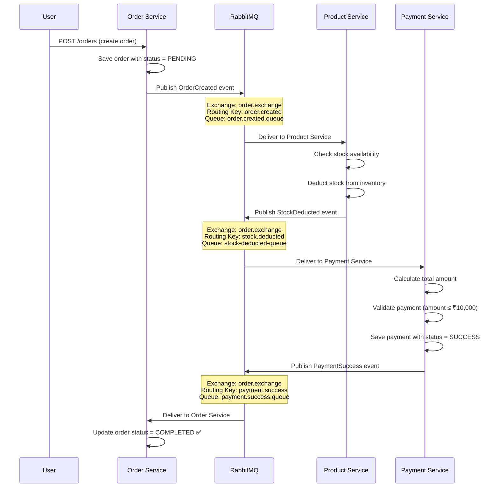
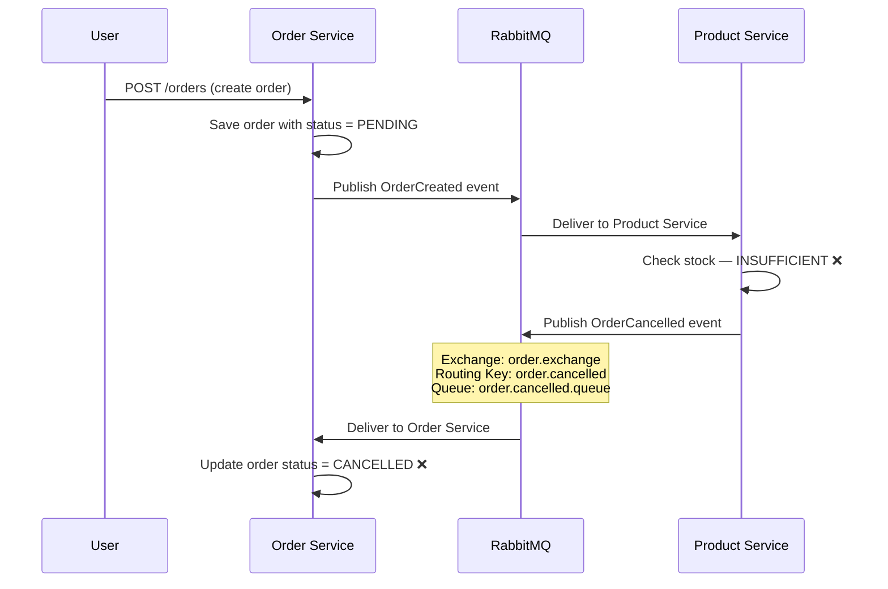
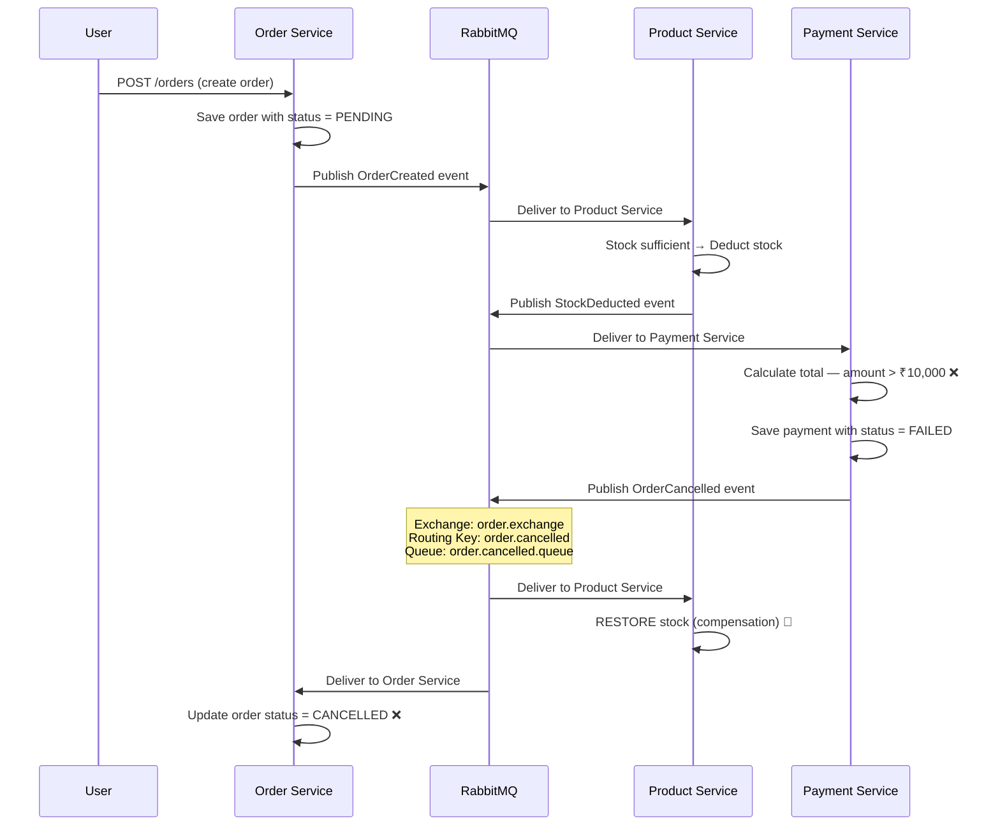

# Saga Choreography Pattern — E-Commerce Microservices

A Spring Boot microservices project demonstrating the **Saga Choreography Pattern** using **RabbitMQ** for event-driven communication, **Eureka** for service discovery, and **Resilience4j** for circuit breaking.

## Architecture Overview

| Service | Port | Database | Purpose |
|---------|------|----------|---------|
| **Eureka Server** | `8761` | — | Service discovery & registry |
| **Order Service** | `8081` | PostgreSQL (`orderdb`) | Manages orders, initiates the saga |
| **Product Service** | `8082` | MySQL (`productdb`) | Manages inventory, deducts/restores stock |
| **Payment Service** | `8083` | PostgreSQL (`paymentdb`) | Processes payments, triggers success or rollback |

---

## End-to-End Saga Flow

### ✅ Happy Path (Order → Product → Payment → Order)



**Step-by-step:**

1. **User creates an order** → Order Service saves it with `status = PENDING`
2. **Order Service publishes** `OrderCreated` event with order details (product name, quantity)
3. **Product Service receives** the event, finds the product by name, checks stock
4. **Stock is sufficient** → Product Service deducts stock and publishes `StockDeducted` event
5. **Payment Service receives** the event, fetches product price, calculates total
6. **Payment is valid** (amount ≤ ₹10,000) → saves payment as `SUCCESS`, publishes `PaymentSuccess` event
7. **Order Service receives** the success signal → updates order status to `COMPLETED`

---

### ❌ Compensation Path 1: Insufficient Stock



**What happens:** Product Service detects insufficient stock → publishes cancellation → Order Service marks order as `CANCELLED`. No stock was deducted, so no inventory restore needed.

---

### ❌ Compensation Path 2: Payment Failure



**What happens:** Payment fails → publishes cancellation → Product Service **restores the deducted stock** (compensation) → Order Service marks order as `CANCELLED`.

---

## RabbitMQ Configuration

### Exchange

| Exchange Name | Type | Used By | Description |
|---------------|------|---------|-------------|
| `order.exchange` | Direct | All 3 services | Central exchange that routes all saga events using routing keys |

### Queues

| Queue Name | Consumed By | Description |
|------------|-------------|-------------|
| `order.created.queue` | Product Service | Receives new order events to trigger stock deduction |
| `order.updated.queue` | — | Receives order update events (for future use) |
| `order.deleted.queue` | — | Receives order deletion events (for future use) |
| `stock-deducted-queue` | Payment Service | Receives stock deduction confirmation to trigger payment processing |
| `payment.success.queue` | Order Service | Receives payment success signal to finalize the order as COMPLETED |
| `order.cancelled.queue` | Order Service, Product Service | Receives cancellation/rollback signal — Order Service marks CANCELLED, Product Service restores stock |

### Routing Keys

| Routing Key | Publisher | Description |
|-------------|-----------|-------------|
| `order.created` | Order Service | Published when a new order is created (triggers the saga) |
| `order.updated` | Order Service | Published when an existing order is updated |
| `order.deleted` | Order Service | Published when an order is deleted |
| `stock.deducted` | Product Service | Published after stock is successfully deducted |
| `payment.success` | Payment Service | Published when payment succeeds (happy path) |
| `order.cancelled` | Product Service, Payment Service | Published on failure — insufficient stock or payment failure (compensation path) |

### Routing Key → Queue Bindings

```
order.exchange
├── order.created    → order.created.queue      (Product Service listens)
├── order.updated    → order.updated.queue
├── order.deleted    → order.deleted.queue
├── stock.deducted   → stock-deducted-queue      (Payment Service listens)
├── payment.success  → payment.success.queue     (Order Service listens)
└── order.cancelled  → order.cancelled.queue     (Order + Product Service listen)
```

---

## Order Status Lifecycle

```
PENDING ──────┬──────────→ COMPLETED  (payment succeeded)
              │
              └──────────→ CANCELLED  (insufficient stock OR payment failed)
```

## Docker Compose Setup

Each service has its own `docker-compose.yml` for its database. RabbitMQ is shared and defined in the order-service compose file.

```bash
# 1. Start infrastructure (RabbitMQ + Order DB)
cd order-service && docker compose up -d

# 2. Start Product DB
cd product-service && docker compose up -d

# 3. Start Payment DB
cd payment-service && docker compose up -d
```

| Service | Database Port | RabbitMQ AMQP | RabbitMQ Dashboard |
|---------|--------------|---------------|-------------------|
| order-service | `5432` (PostgreSQL) | `5672` | `http://localhost:15672` |
| product-service | `3307` (MySQL) | — | — |
| payment-service | `5433` (PostgreSQL) | — | — |

> **RabbitMQ Dashboard:** http://localhost:15672 (user: `guest`, password: `guest`)

---

## Tech Stack

- **Java 17** + **Spring Boot 3.x**
- **Spring Cloud** — Eureka (service discovery), OpenFeign (inter-service HTTP calls)
- **Spring AMQP** — RabbitMQ messaging
- **Resilience4j** — Circuit breaker + retry
- **PostgreSQL** — Order & Payment databases
- **MySQL** — Product database
- **Docker Compose** — Infrastructure provisioning
